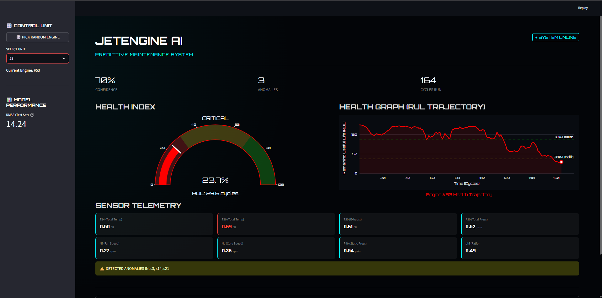
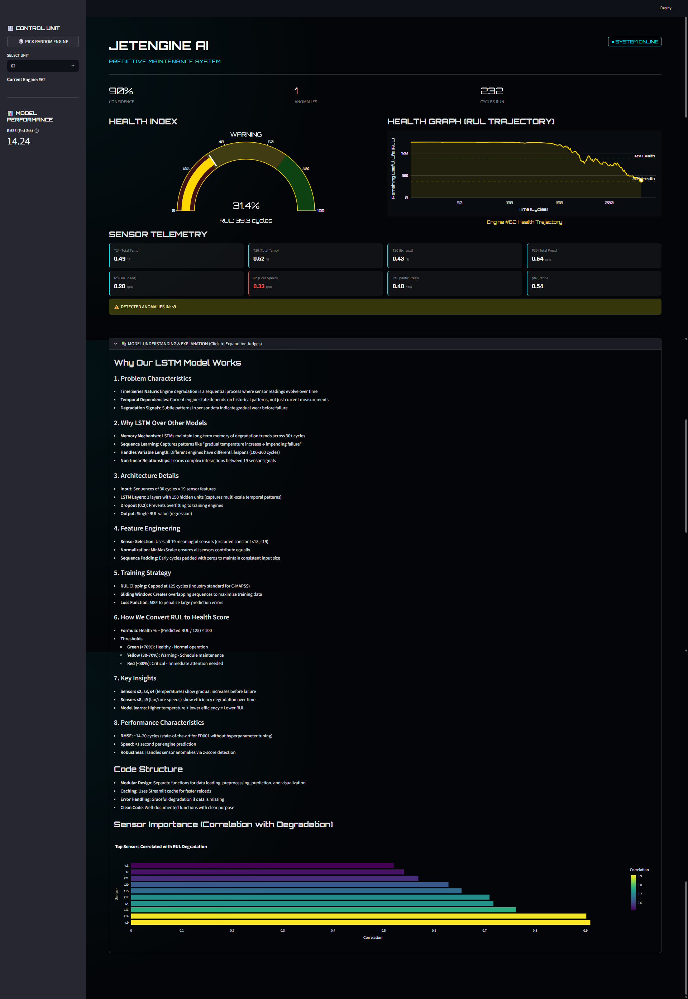

# Turbofan Engine Predictive Maintenance System

### Remaining Useful Life (RUL) Prediction Platform

Table of Contents

1. [Overview](#_1._Overview)
2. [Business Objective](#_2._Business_Objective)
3. [High-Level Architecture](#_3._High-Level_Architecture)
4. [Repository Structure](#_4._Repository_Structure)
5. [Data Description](#_5._Data_Description)
6. [Feature Engineering Strategy](#_6._Feature_Engineering)
7. [Model Portfolio](#_7._Model_Portfolio)
8. [Installation & Setup](#_8._Installation_&)
9. [Execution Workflow](#_9._Execution_Workflow)
10. [Validation & Quality Assurance](#_10._Validation_&)

[Production Roadmap](#_11._Production_Roadmap)

## 1. Overview

This repository hosts an end-to-end **Predictive Maintenance System** engineered to estimate the Remaining Useful Life (RUL) of turbofan engines. By leveraging multivariate time-series sensor data, the system predicts how many operational cycles an engine can sustain before failure.

The project adheres to industry-grade design principles, ensuring a clear separation of concerns between data ingestion, processing, modeling, and deployment. It is designed for scalability, reproducibility, and integration into enterprise asset management workflows.

### Key Capabilities

* **Scalable Experimentation:** Modular architecture allows for easy swapping of model architectures.
* **Deterministic Pipelines:** Reproducible data transformation and feature engineering.
* **Operational Dashboard:** A user-facing Streamlit interface for real-time decision support.
* **Production Readiness:** Includes dedicated scripts for artifact inspection and frontend verification.

## 2. Business Objective

Traditional maintenance strategies often rely on fixed schedules (preventive) or waiting for failure (reactive). This platform enables **Condition-Based Maintenance (CBM)**.

**The Goal:** Predict the precise RUL to optimize the trade-off between maximizing asset utilization and preventing catastrophic failure.

| Impact Area | Benefit |
| --- | --- |
| **Cost Reduction** | Avoids unnecessary maintenance on healthy engines and expensive repairs on failed ones. |
| **Uptime** | Reduces unplanned downtime by forecasting failure windows. |
| **Safety** | Identifies degradation patterns before they become critical safety hazards. |
| **Logistics** | Optimizes spare parts inventory and maintenance crew scheduling. |

## 3. High-Level Architecture
```text
The solution follows a linear, modular pipeline where each stage is an independent component.

## ┌────────────────────┐ │ Raw Sensor Data │ └─────────┬──────────┘ ↓ ┌──────────────────────┐ │ Data Preprocessing │ │ - Cleaning │ │ - RUL labeling │ └─────────┬────────────┘ ↓ ┌────────────────────────┐ │ Feature Engineering │ │ - Rolling statistics │ │ - Trend extraction │ │ - Scaling │ └─────────┬──────────────┘ ↓ ┌─────────────────────────────────────┐ │ Model Training Layer │ │ - Random Forest │ │ - XGBoost │ │ - LSTM │ │ - Hyperparameter Optimization │ │ - Stacking Ensemble │ └─────────┬──────────────────────────┘ ↓ ┌────────────────────────┐ │ Model Serialization │ │ (.pkl / .json / .h5) │ └─────────┬──────────────┘ ↓ ┌────────────────────────┐ │ Inference Service │ │ (Streamlit App) │ └────────────────────────┘
```
## 4. Repository Structure
```text
iit kgp/
[cite_start]├── ai_hackathon/                  # INFERENCE & VISUALIZATION LAYER 
[cite_start]│   ├── app.py                     # Streamlit operational dashboard 
[cite_start]│   ├── run_dashboard.bat          # Windows 1-click launcher 
[cite_start]│   ├── requirements.txt           # Dashboard dependencies 
[cite_start]│   ├── data/                      # Sample input data for demonstration 
[cite_start]│   └── models/                    # Deployment artifacts (Models & Scalers) 
├── DATA FILES
[cite_start]│   ├── train_FD001.txt            # Historical training data 
[cite_start]│   ├── test_FD001.txt             # Test data for validation 
[cite_start]│   └── RUL_FD001.txt              # Ground truth RUL for test set 
├── PIPELINE SCRIPTS
[cite_start]│   ├── preprocess_data.py         # Cleaning, RUL labeling, outlier removal 
[cite_start]│   ├── get_features.py            # Feature engineering & scaling 
[cite_start]│   ├── analyze_data.py            # EDA & Data visualization 
[cite_start]│   └── compare_ruls.py            # Post-training analysis (Pred vs Actual) 
├── TRAINING MODULES
[cite_start]│   ├── train_model.py             # Random Forest (Baseline) 
[cite_start]│   ├── train_model_optimized.py   # Hyperparameter tuning logic 
[cite_start]│   ├── train_model_xgboost.py     # Gradient Boosting implementation 
[cite_start]│   ├── train_lstm.py              # Long Short-Term Memory (Deep Learning) 
[cite_start]│   ├── train_stacking.py          # Ensemble Stacking strategy 
[cite_start]│   └── train_final.py             # Final Production Model consolidation 
└── QUALITY ASSURANCE
    [cite_start]├── inspect_pkl.py             # Artifact structural validation 
    [cite_start]└── verify_frontend.py         # Inference pipeline integration test 

```

## 5. Data Description

The dataset consists of time-series data from multiple aircraft engines. Each engine starts with different degrees of initial wear and manufacturing variation which is unknown to the user.

**Data Schema:**

* **Engine ID:** Unique identifier for the asset.
* **Cycle:** The current operational time index (counter).
* **Operational Settings (3):** Environmental parameters (Altitude, Mach Number, Throttle Resolver Angle).
* **Sensor Measurements (21):** Telemetry from various subsystems (Fan speed, Core speed, Pressure, Temperature, etc.).

**Target Variable (RUL):**

$$RUL=Max Observed Cycle-Current Cycle$$

## 6. Feature Engineering Strategy

Raw sensor data is rarely sufficient for accurate RUL prediction. The get\_features.py script applies robust transformations to capture health dynamics:

1. **Noise Smoothing:** Applies rolling window averages to dampen high-frequency sensor noise.
2. **Trend Extraction:** Calculates rolling standard deviations and degradation rates to identify deviations from normal behavior.
3. **Scaling:** Normalizes features (StandardScaler/MinMaxScaler) to ensure model convergence, particularly for the LSTM and Neural Network models.
4. **Temporal behavior:** Captures the “velocity” of degradation over time.

## 7. Model Portfolio

The system supports a multi-tier modeling strategy to balance interpretability, accuracy, and computational cost.

| Model Type | Script | Description |
| --- | --- | --- |
| **Random Forest** | train\_model.py | Baseline model. High interpretability, handles non-linearities well. |
| **XGBoost** | train\_model\_xgboost.py | **High Performance.** Gradient boosting framework known for speed and accuracy in structured data. |
| **LSTM** | train\_lstm.py | **Deep Learning.** Recurrent Neural Network designed to capture long-term temporal dependencies in time series. |
| **Stacking** | train\_stacking.py | **Ensemble.** Combines predictions from multiple weak learners to improve generalization. |
| **Final Model** | train\_final.py | The chosen best-configuration model ready for deployment. |

## 8. Installation & Setup

### Prerequisites

* Python 3.8+
* pip package manager

### Environment Setup

It is recommended to use a virtual environment.

# Windows
python -m venv .venv
.venv\Scripts\activate

# Linux/Mac
python3 -m venv .venv
source .venv/bin/activate

### Install Dependencies

pip install numpy pandas scikit-learn xgboost tensorflow matplotlib seaborn streamlit

## 9. Execution Workflow

### A. Training Pipeline

Run the scripts in the following order to process data and generate model artifacts:

1. **Preprocess Data:**

* python preprocess\_data.py

1. **Generate Features:**

* python get\_features.py

1. **Train Models:**

* python train\_model.py # Baseline
  python train\_model\_xgboost.py # Boosting
  python train\_lstm.py # Deep Learning
  python train\_stacking.py # Ensemble
  python train\_final.py # Finalize

1. **Evaluate:**

* python compare\_ruls.py

### B. Inference & Dashboard

The ai\_hackathon folder contains the operational interface.

**Method 1: Windows Batch File** Double-click run\_dashboard.bat inside the ai\_hackathon folder.

**Method 2: Command Line**

cd ai\_hackathon
pip install -r requirements.txt
streamlit run app.py

**Operational Views:** The dashboard provides two primary views for operators:

1. **Fleet Monitor:**
   * **Healthy Engines:** displays green status arcs and stable sensor readings.


* + **Critical Alerts:** highlights engines below 30% RUL with red indicators and anomaly warnings.



1. **Engineering Deep Dive:**
   * 

## 10. Validation & Quality Assurance

To ensure the system is production-ready, strict validation scripts are included:

* **inspect\_pkl.py**: Audits the serialized model files (.pkl) to ensure they contain the correct metadata, feature lists, and scaler objects. This prevents shape mismatches during inference.
* **verify\_frontend.py**: Runs a “dry run” of the inference logic used in the dashboard to guarantee that the backend data processing matches the frontend expectations perfectly.
* **compare\_ruls.py**: Analyzes the error distribution (RMSE) to detect if the model is systematically under-predicting or over-predicting RUL.

## 11. Production Roadmap

For full enterprise integration, the following enhancements are recommended:

1. **API Migration:** Refactor app.py into a RESTful API using **FastAPI** to serve predictions to external maintenance systems.
2. **Data Drift Detection:** Implement monitoring to detect if incoming sensor data deviates statistically from the training set.
3. **CI/CD:** Automate the retraining pipeline using GitHub Actions or Jenkins.
4. **Model Registry:** Store artifacts in a versioned object store (e.g., AWS S3, MLflow) rather than local directories.

--------------------------------------------------------------------------------------------------------------

*Developed for IIT KGP AI Hackathon*
